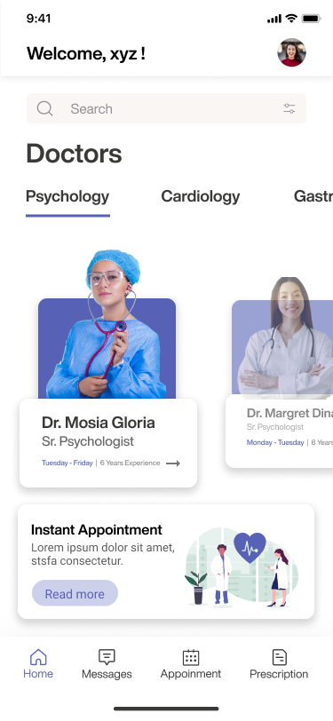
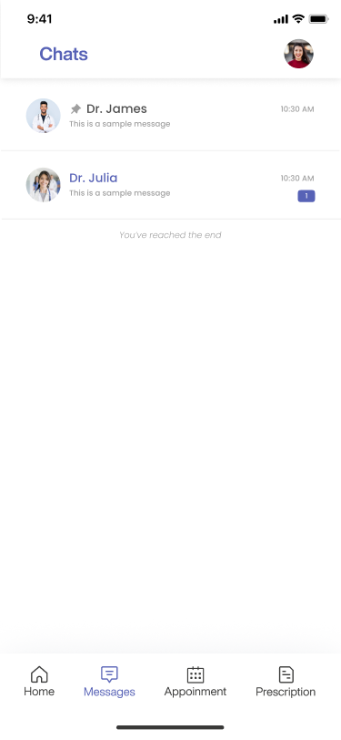
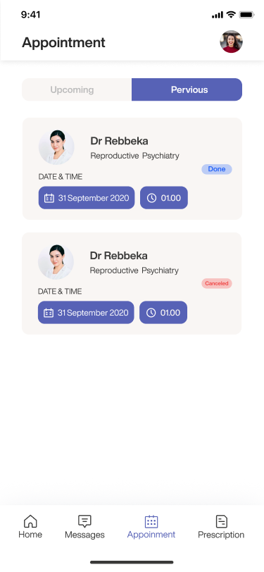

# Aderis Health Mobile App

A health, doctor, patient mobile app made using Flutter.

## Guidelines To Contribute:
Just open a `pull request` if you would like to add something. To open a pull request

- Click `fork` on the top right corner. An online copy of this repo will be made on your account.
- `Clone` the repository in you computer or just press "." button in your keyboard to open VS code Web.
- Do the changes you want to and commit them.
- Once you do these steps, you will see an option `Compare & Pull Request`, or you can just go to the parent repository and go to the pull requests section and make a pull request.
- Write about whatever changes you added.
= Wait for me to `review` your changes and merge the valid ones into the master branch.

"Something" can be:

- Code
- Comments
- Documentation
- New Features
- Issue Fixes

